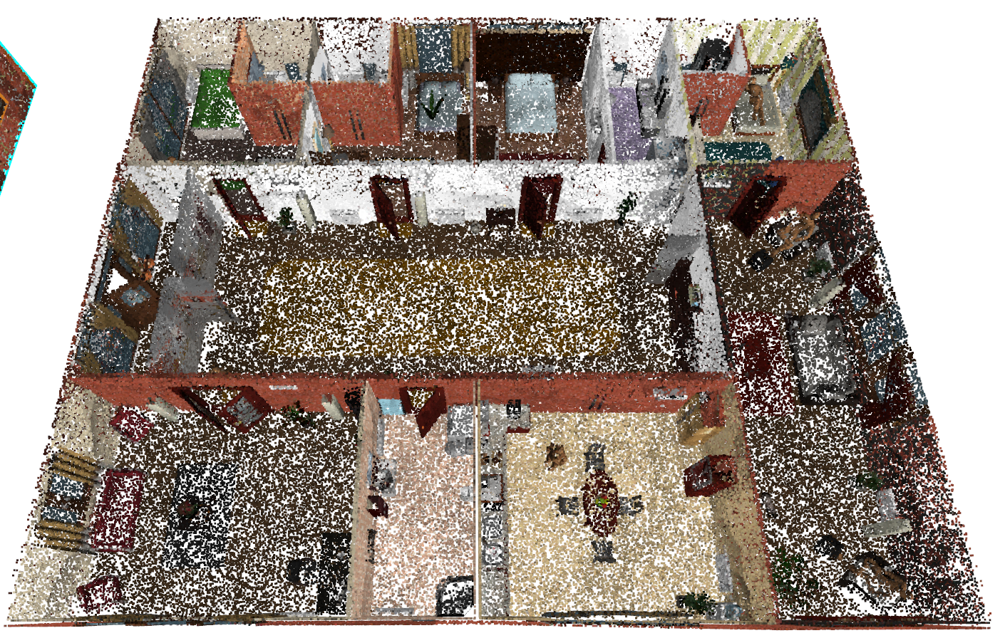
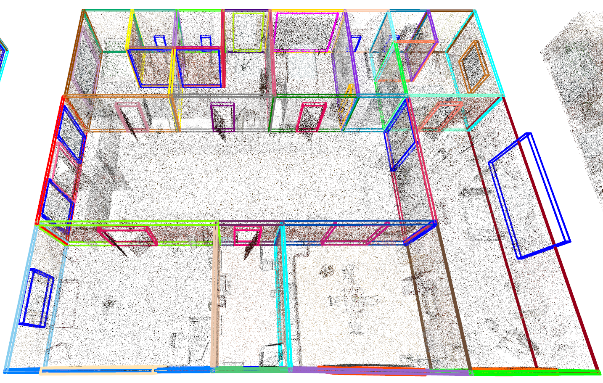
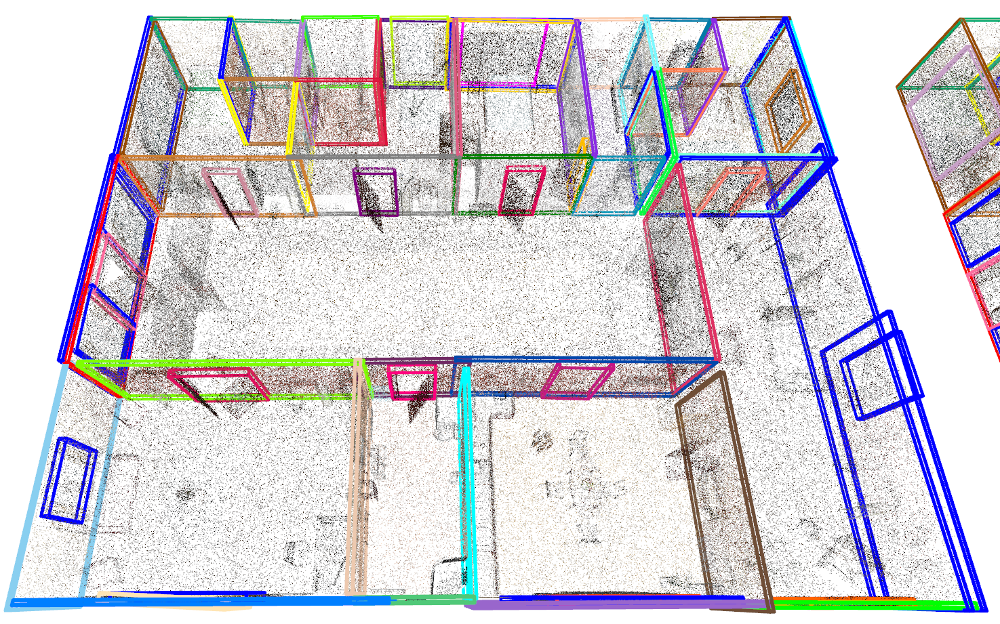
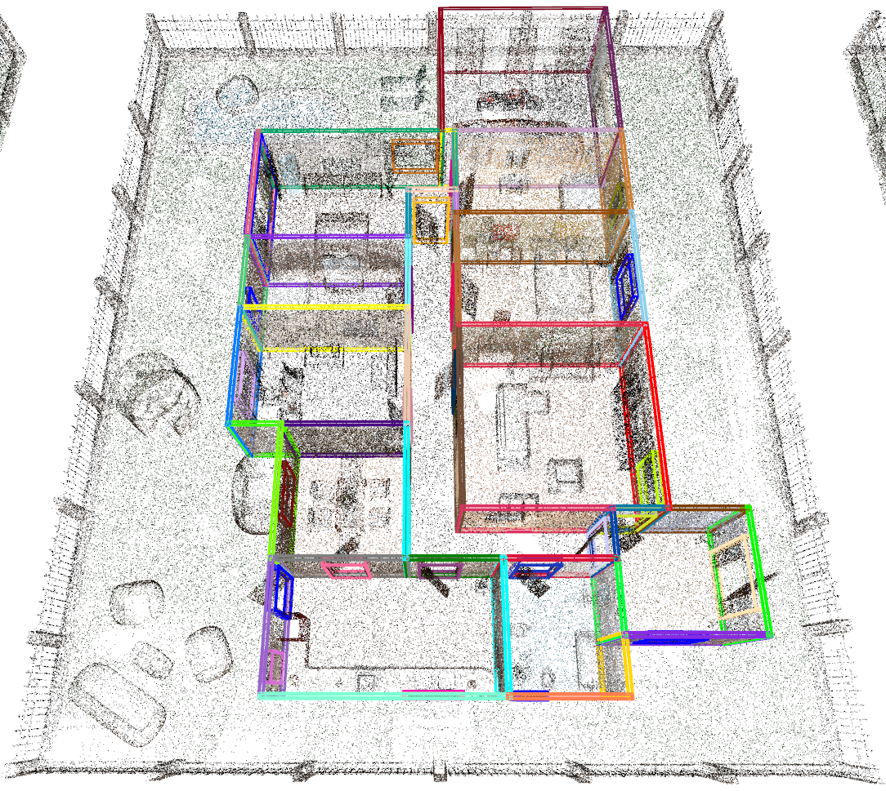

# Task
* Input: point cloud of indoor building. 
* Five objects: wall, window, door, ceiling, floor
* Output: 3D bounding boxes of objects

# SYNBIM
We have constructed the first large-scale as-built BIM dataset.
* 5239 for training + 1311 for test
* Average foot area of each building is 471.936 m^2. Total area reaches 3.093 km^2.

# Detection Examles    
mAP: 81%
mIoU: 86%

| First Header  | Second Header |
| ------------- | ------------- |
| Content Cell  | Content Cell  |
| Content Cell  | Content Cell  |

# Scene 1
|||
:-------------------------:|:-------------------------:
 |  Point cloud  
  Ground truth  |  Detection   

# Scene 2
| |  Point cloud   |
|---|---|
| Ground truth  |  Detection    |

# Scene 3
| | Point cloud  |
|---|---|
|  Ground truth  |  Detection   |

# Scene 4
| |  Point cloud  |
|---|---|
| Ground truth  |  Detection    |

